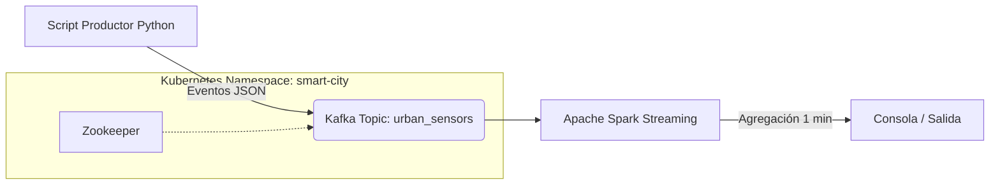
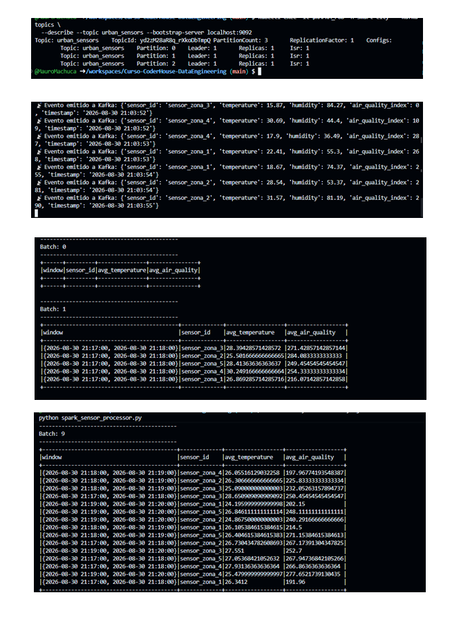

# Proyecto Integrador: Plataforma de Muestreo Urbano en Tiempo Real

Plataforma de procesamiento de datos distribuidos utilizando Kubernetes, Apache Kafka y Apache Spark Structured Streaming para el análisis de métricas de calidad del aire y temperatura en entornos urbanos.

## Arquitectura



## Estructura del repositorio

```
k8s/                          # Manifiestos de Kubernetes
  00-namespace.yaml
  01-configmap.yaml
  02-zookeeper.yaml
  03-kafka.yaml
sensor_producer.py             # Productor Kafka (Python)
spark_sensor_processor.py      # Job de Spark Structured Streaming
docs-evidenciaS-entrega3/      # Capturas de evidencia
```

## Despliegue

Requisitos: clúster de Kubernetes disponible (probado con [kind](https://kind.sigs.k8s.io/)) y `kubectl` configurado.

```bash
# 1. Crear namespace, configmap y desplegar Zookeeper + Kafka
kubectl apply -f k8s/00-namespace.yaml
kubectl apply -f k8s/01-configmap.yaml
kubectl apply -f k8s/02-zookeeper.yaml
kubectl apply -f k8s/03-kafka.yaml

# 2. Verificar que los pods estén Running
kubectl get pods -n smart-city

# 3. Crear el tópico con 3 particiones
KAFKA_POD=$(kubectl get pod -n smart-city -l app=kafka -o jsonpath='{.items[0].metadata.name}')
kubectl exec -it $KAFKA_POD -n smart-city -- kafka-topics \
  --create --topic urban_sensors \
  --bootstrap-server localhost:9092 \
  --partitions 3 --replication-factor 1

# 4. Exponer Kafka fuera del clúster
kubectl port-forward svc/kafka -n smart-city 9092:9092
```

En terminales separadas, con `KAFKA_BOOTSTRAP_SERVERS=localhost:9092` y `KAFKA_TOPIC=urban_sensors` exportados:

```bash
# Productor
pip install kafka-python
python sensor_producer.py

# Spark Structured Streaming
pip install pyspark==3.5.1
python spark_sensor_processor.py
```


## Evidencia

La siguiente captura muestra las tres partes del flujo funcionando en simultáneo: la creación del tópico `urban_sensors` con 3 particiones, el productor emitiendo eventos JSON, y el job de Spark procesando el stream con la agregación `avg_temperature` / `avg_air_quality` por `sensor_id` en ventanas de 1 minuto — confirmando la comunicación exitosa entre Kafka y Spark.



La consola de Spark muestra micro-batches con la agregación `avg_temperature` y `avg_air_quality` por `sensor_id`, calculada sobre ventanas de 1 minuto, confirmando la comunicación exitosa entre el productor, Kafka y Spark.